# Button Function Implementation Design

## Overview

This design document outlines the implementation of placeholder button functions in the Flutter Meal Generator application. The current codebase contains several "coming soon" placeholders that need to be replaced with functional implementations. The goal is to provide complete button functionality while maintaining code quality, accessibility standards, and following Flutter best practices.

## Technology Stack & Dependencies

- **Framework**: Flutter 3.0+
- **State Management**: Provider pattern
- **Database**: SQLite (sqflite)
- **UI Components**: Material Design 3
- **Testing**: flutter_test, mockito
- **Architecture**: MVVM with Provider

## Component Architecture

### Button Function Categories

The application contains the following categories of button functions that require implementation:

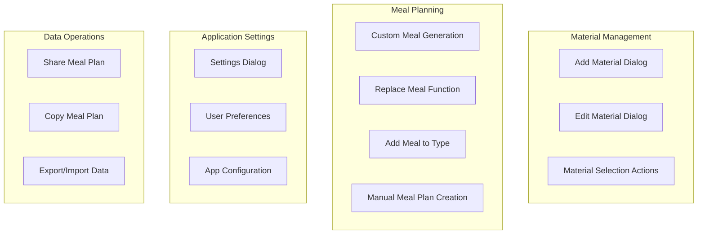

### Dialog Component Hierarchy

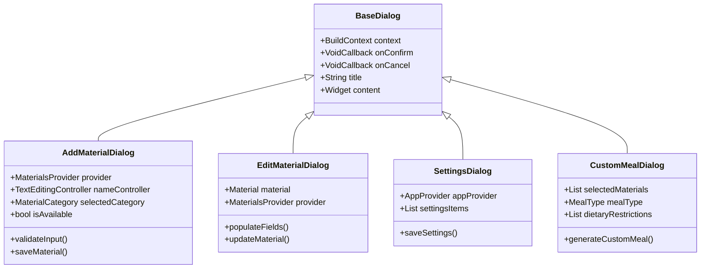

## Core Implementation Strategy

### 1. Material Management Functions

#### Add Material Dialog Implementation

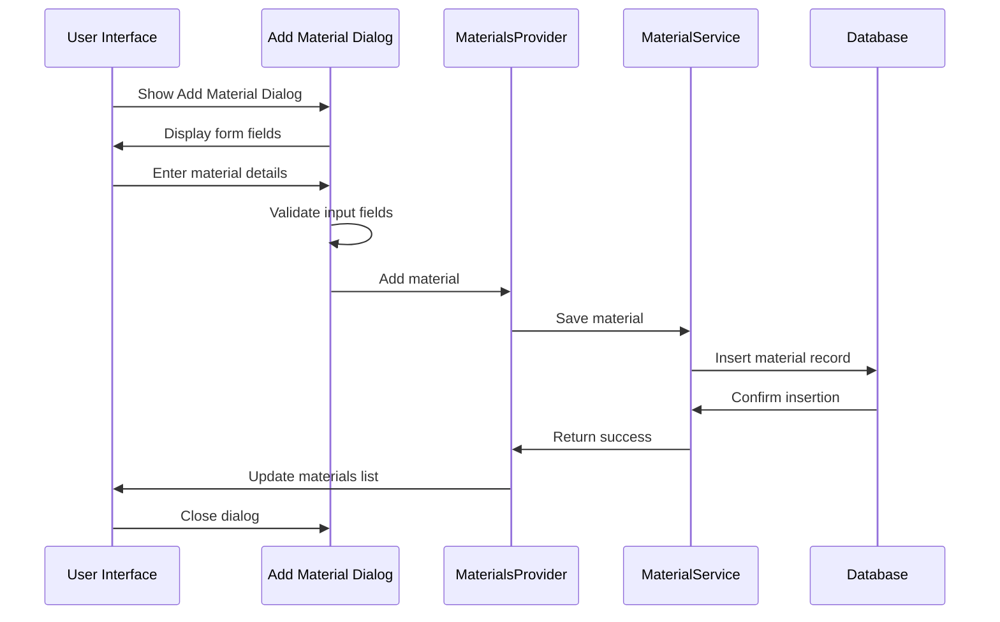

#### Edit Material Dialog Implementation

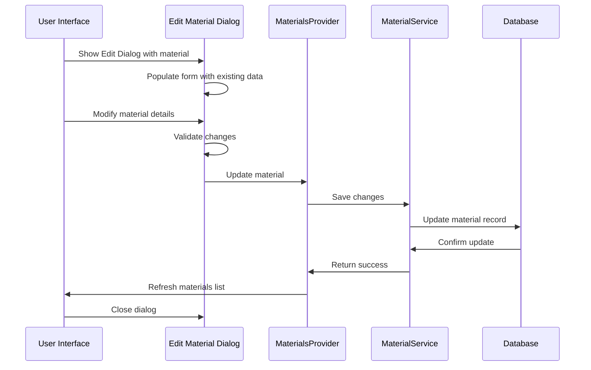

### 2. Meal Planning Functions

#### Custom Meal Generation Flow

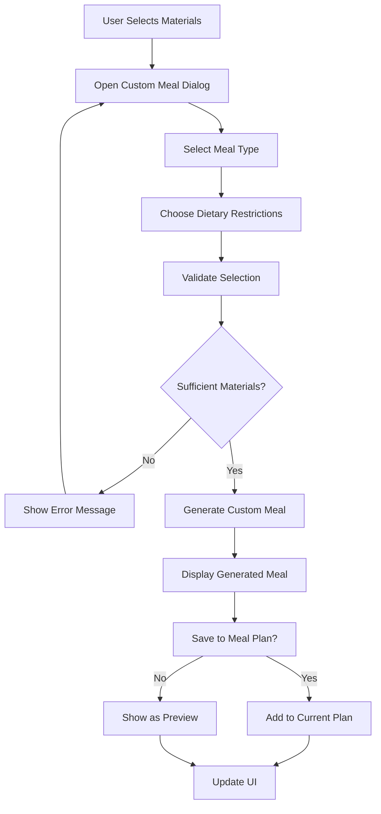

#### Replace Meal Function Flow

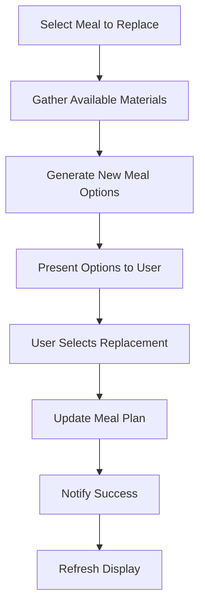

### 3. Application Settings Implementation

#### Settings Dialog Structure

```mermaid
graph TB
    subgraph "Settings Categories"
        A[General Settings]
        B[Meal Preferences]
        C[Dietary Restrictions]
        D[Notification Settings]
        E[Data Management]
    end
    
    A --> A1[Theme Selection]
    A --> A2[Language Settings]
    A --> A3[Default Calendar View]
    
    B --> B1[Default Meal Types]
    B --> B2[Portion Sizes]
    B --> B3[Cuisine Preferences]
    
    C --> C1[Dietary Restriction List]
    C --> C2[Allergy Information]
    C --> C3[Custom Restrictions]
    
    D --> D1[Meal Reminders]
    D --> D2[Planning Notifications]
    D --> D3[Shopping List Alerts]
    
    E --> E1[Export Data]
    E --> E2[Import Data]
    E --> E3[Clear All Data]
```

## Data Flow Architecture

### Material Data Operations

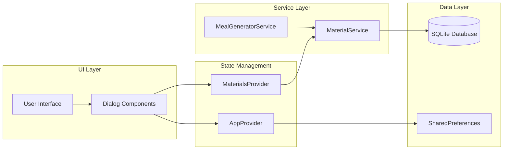

### Meal Planning Data Flow

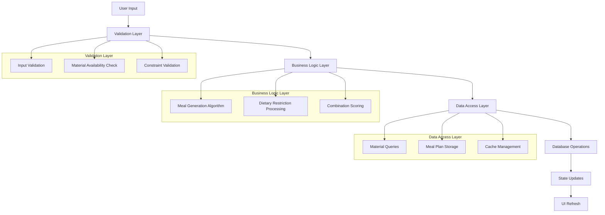

## API Integration Layer

### Material Management API

| Function | Input | Output | Error Handling |
|----------|-------|--------|---------------|
| `addMaterial` | Material object | Success/Error | Validation errors, Database errors |
| `updateMaterial` | Material object | Success/Error | Not found, Validation errors |
| `deleteMaterial` | Material ID | Success/Error | Dependency check, Not found |
| `toggleAvailability` | Material ID | Updated Material | Not found errors |

### Meal Generation API

| Function | Input | Output | Error Handling |
|----------|-------|--------|---------------|
| `generateCustomMeal` | Materials, MealType, Restrictions | Meal object | Insufficient materials, Algorithm errors |
| `replaceMeal` | MealPlan, MealType, Materials | Updated MealPlan | Generation failure, Save errors |
| `addMealToType` | MealPlan, MealType, Meal | Updated MealPlan | Conflict resolution, Storage errors |

## Error Handling Strategy

### Error Categories and Responses

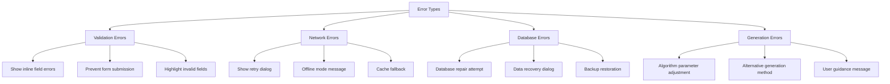

### Error Recovery Mechanisms

1. **Automatic Retry**: Network and temporary database errors
2. **User Guidance**: Clear error messages with action suggestions
3. **Graceful Degradation**: Fallback to cached data when possible
4. **Data Recovery**: Backup and restore capabilities

## Performance Optimization

### Dialog Performance Patterns

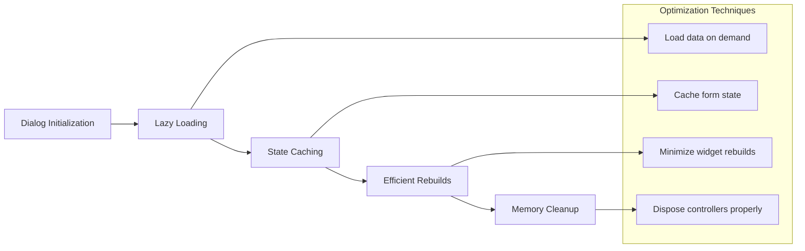

### Memory Management

1. **Controller Disposal**: Proper cleanup of TextEditingController instances
2. **State Cleanup**: Clear temporary state when dialogs close
3. **Cache Management**: Limit cached meal generation results
4. **Image Loading**: Efficient image caching for material images

## Testing Strategy

### Unit Testing Coverage

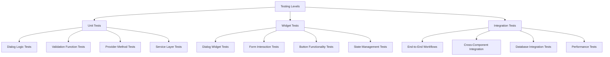

### Test Implementation Structure

| Test Category | Coverage Target | Key Test Cases |
|---------------|----------------|----------------|
| Dialog Logic | 90%+ | Input validation, State transitions, Error scenarios |
| Form Validation | 100% | Required fields, Format validation, Custom rules |
| Provider Methods | 95%+ | State updates, Error handling, Async operations |
| Widget Interactions | 85%+ | Button taps, Form submissions, Navigation flows |

## Accessibility Compliance

### WCAG 2.1 AA Standards

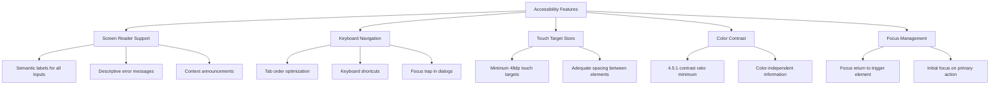

### Implementation Requirements

1. **Semantic Labeling**: All form fields must have proper labels
2. **Error Communication**: Screen reader accessible error messages
3. **Focus Management**: Proper focus flow in dialogs
4. **Touch Targets**: Minimum 48dp for all interactive elements
5. **Keyboard Support**: Full keyboard navigation capability

## Implementation Phases

### Phase 1: Core Material Management (Week 1)
- Add Material Dialog implementation
- Edit Material Dialog implementation
- Form validation and error handling
- Unit tests for material operations

### Phase 2: Meal Planning Functions (Week 2)
- Custom meal generation dialog
- Replace meal functionality
- Add meal to type implementation
- Integration with meal generation service

### Phase 3: Application Settings (Week 3)
- Settings dialog implementation
- User preference management
- Data persistence for settings
- Settings-related unit tests

### Phase 4: Data Operations & Polish (Week 4)
- Share meal plan functionality
- Copy meal plan implementation
- Export/import capabilities
- Final testing and accessibility audit

## Quality Assurance

### Code Quality Standards

1. **Flutter Best Practices**: Follow official Flutter style guide
2. **Clean Architecture**: Maintain separation of concerns
3. **Error Handling**: Comprehensive error scenarios coverage
4. **Performance**: Efficient memory usage and smooth animations
5. **Accessibility**: Full WCAG 2.1 AA compliance
6. **Testing**: Minimum 85% code coverage
7. **Documentation**: Comprehensive inline documentation

### Pre-deployment Checklist

- [ ] All placeholder functions replaced with implementations
- [ ] Unit tests passing with ≥85% coverage
- [ ] Widget tests covering all dialog interactions
- [ ] Integration tests for complete workflows
- [ ] Accessibility audit completed
- [ ] Performance testing on target devices
- [ ] Error handling scenarios validated
- [ ] Code review completed
- [ ] Documentation updated
- [ ] User acceptance testing passed