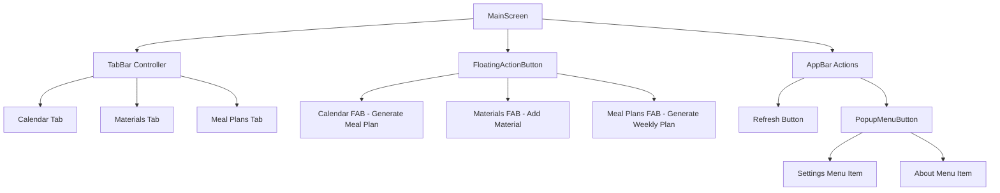
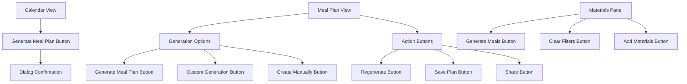
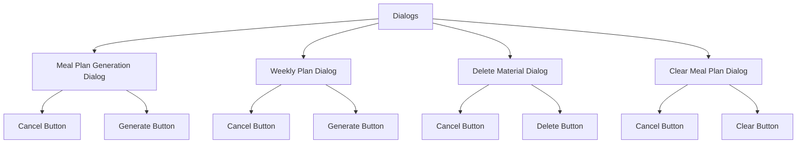

# Button Functionality Testing Design

## Overview

This document outlines a comprehensive testing strategy to ensure all buttons related to meal plan generation are functioning properly in the Flutter Meal Planner application. The app contains multiple button types across different UI screens that trigger meal generation, material management, and user interaction workflows.

## Technology Stack & Dependencies

**Framework**: Flutter (Dart)
**State Management**: Provider pattern
**Navigation**: TabBar with TabBarView
**UI Components**: Material Design components
**Testing Framework**: flutter_test

## Button Component Architecture

### Primary Navigation Buttons



### Secondary Action Buttons



### Interactive Dialog Buttons



## Button Functionality Mapping

### Floating Action Buttons (Context-Sensitive)

| Tab Context | Button Icon | Tooltip | Primary Action | Secondary Actions |
|-------------|-------------|---------|----------------|-------------------|
| Calendar | `Icons.auto_awesome` | "Generate Meal Plan" | Shows confirmation dialog | Validates materials availability |
| Materials | `Icons.add` | "Add Material" | Shows placeholder snackbar | Future: Material creation form |
| Meal Plans | `Icons.view_week` | "Generate Weekly Plan" | Shows weekly confirmation dialog | Validates materials, generates 7-day plan |

### AppBar Action Buttons

| Button Type | Icon | Function | Expected Behavior |
|-------------|------|----------|-------------------|
| Refresh | `Icons.refresh` | `_loadInitialData()` | Reloads materials and meal plans |
| Settings Menu | `Icons.settings` | `_showSettingsDialog()` | Shows placeholder settings dialog |
| About Menu | `Icons.info` | `_showAboutDialog()` | Shows app information dialog |

### Meal Plan Generation Buttons

| Location | Button Text | Icon | Function | Validation Requirements |
|----------|-------------|------|----------|-------------------------|
| Calendar Empty State | "Generate Meal Plan" | `Icons.auto_awesome` | Redirects to FAB | Must have available materials |
| Meal Plan View Empty | "Generate Meal Plan" | `Icons.auto_awesome` | Redirects to FAB | Must have available materials |
| Meal Plan View Empty | "Custom Generation" | `Icons.tune` | Shows placeholder | Future: Custom meal type selection |
| Meal Plan View Empty | "Create Manually" | `Icons.edit` | Shows placeholder | Future: Manual meal creation |

### Material Management Buttons

| Location | Button Text | Icon | Function | Validation Requirements |
|----------|-------------|------|----------|-------------------------|
| Materials Panel | "Generate Meals" | `Icons.restaurant` | Process selected materials | Must have at least one selected material |
| Materials Empty State | "Add Materials" | `Icons.add` | Shows placeholder | Future: Material creation form |
| Materials Filter | "Clear Filters" | None | Resets all filters | Only visible when filters active |

### Existing Meal Plan Action Buttons

| Button Text | Icon | Function | User Confirmation |
|-------------|------|----------|-------------------|
| "Regenerate" | `Icons.refresh` | Shows placeholder | None |
| "Save Plan" | `Icons.save` | Shows success message | None |
| "Share Plan" | `Icons.share` | Shows placeholder | None |

## Testing Strategy

### Unit Testing Requirements (flutter_test)

#### Button State Testing
```dart
/// Tests button visibility and state based on tab context
/// Validates that FloatingActionButton changes correctly when switching tabs
testWidgets('FloatingActionButton changes based on selected tab', (tester) async {
  // Given: App is initialized with MaterialsProvider and MealPlansProvider
  // When: User switches between Calendar, Materials, and Meal Plans tabs
  // Then: FAB icon and tooltip should change accordingly
  // - Calendar tab: Icons.auto_awesome with "Generate Meal Plan" tooltip
  // - Materials tab: Icons.add with "Add Material" tooltip
  // - Meal Plans tab: Icons.view_week with "Generate Weekly Plan" tooltip
});

/// Tests button enabled/disabled states based on material availability
/// Ensures proper validation before allowing meal generation
testWidgets('Generate buttons validate material availability', (tester) async {
  // Given: MaterialsProvider with empty or populated materials list
  // When: User attempts to generate meal plan
  // Then: Button should show appropriate error message if no materials available
  // And: Button should proceed with generation if materials exist
});
```

#### Button Action Testing
```dart
/// Tests dialog button interactions for meal plan generation
/// Validates complete dialog workflow from opening to action execution
testWidgets('Generate meal plan dialog buttons work correctly', (tester) async {
  // Given: User is on Calendar tab with available materials
  // When: User taps FAB to open meal plan generation dialog
  // Then: Dialog should display with Cancel and Generate buttons
  // When: User taps Cancel button
  // Then: Dialog should close without triggering generation
  // When: User taps Generate button
  // Then: Dialog should close and trigger meal plan generation
});

/// Tests material selection validation workflow
/// Ensures proper feedback when materials are not selected
testWidgets('Material selection validation works', (tester) async {
  // Given: MaterialsPanel is displayed
  // When: User attempts to generate meals without selecting materials
  // Then: Error message should be displayed via SnackBar
  // When: User selects materials and attempts generation
  // Then: Generation should proceed with success feedback
});
```

#### Provider Integration Testing
```dart
/// Tests state management integration with button actions
/// Validates that button presses trigger correct provider methods
testWidgets('Buttons trigger correct provider methods', (tester) async {
  // Given: Mock providers are injected into widget tree
  // When: User performs button actions (generate, save, delete)
  // Then: Corresponding provider methods should be called with correct parameters
  // And: Provider state should update appropriately
  // And: UI should reflect state changes immediately
});
```

### Widget Testing Requirements

#### Interactive Testing Scenarios

**Tab Navigation Flow Testing**
```dart
/// Tests complete tab navigation workflow with FAB state changes
/// Ensures UI consistency during rapid user interactions
testWidgets('Tab navigation with FAB state synchronization', (tester) async {
  // Given: MainScreen with TabController initialized
  // When: User rapidly switches between tabs
  // Then: FAB should update without visual glitches or state inconsistencies
  // And: Button tooltips should display correctly for each tab
  // And: No memory leaks should occur during rapid switching
});
```

**Meal Generation Workflow Testing**
```dart
/// Tests end-to-end meal generation workflow
/// Validates complete user journey from button press to completion
testWidgets('Complete meal generation workflow', (tester) async {
  // Given: App with available materials and selected date
  // When: User initiates meal generation via FAB
  // Then: Loading indicator should appear immediately
  // And: Generation should complete with success feedback
  // And: Generated meal plan should be displayed in UI
  // When: Generation fails due to service error
  // Then: Error message should be displayed with retry option
});
```

**Material Management Workflow Testing**
```dart
/// Tests material selection and management operations
/// Ensures proper state management during material operations
testWidgets('Material management workflow', (tester) async {
  // Given: MaterialsPanel with populated materials list
  // When: User selects/deselects materials
  // Then: Selection state should update in real-time
  // When: User applies filters
  // Then: Material list should filter correctly
  // When: User clears filters
  // Then: Full materials list should be restored
  // When: User confirms material deletion
  // Then: Material should be removed with confirmation feedback
});
```

#### Visual Regression Testing

**Button Appearance Validation**
```dart
/// Tests button styling consistency with design system
/// Ensures Material Design compliance across all button states
testWidgets('Button styling and states compliance', (tester) async {
  // Given: Buttons in various states (normal, pressed, disabled)
  // When: UI is rendered
  // Then: Button styling should match AppColors and AppTypography
  // And: Icon and text alignment should be consistent
  // And: Touch target sizes should meet accessibility standards (48dp minimum)
});
```

**Dialog Layout Validation**
```dart
/// Tests dialog responsiveness and layout consistency
/// Validates proper spacing and positioning across screen sizes
testWidgets('Dialog layout responsiveness', (tester) async {
  // Given: Dialogs displayed on different screen sizes
  // When: Dialog is rendered
  // Then: Button positioning should follow Material Design guidelines
  // And: Proper spacing (AppSpacing constants) should be maintained
  // And: Content should not overflow on smaller screens
});
```

### Integration Testing Requirements

#### End-to-End Button Workflows

**Complete Meal Planning Flow**
```dart
/// Integration test for complete meal planning workflow
/// Tests full user journey with real provider implementations
testWidgets('End-to-end meal planning workflow', (tester) async {
  // Given: App initialized with test data and real providers
  // When: User navigates to Calendar tab
  // Then: Calendar view should be displayed with current date selected
  // When: User presses FAB (Generate Meal Plan)
  // Then: Confirmation dialog should appear
  // When: User confirms generation
  // Then: Loading state should be shown during generation
  // And: Meal plan should be created and saved to database
  // And: Success message should be displayed
  // When: User views created meal plan
  // Then: Action buttons (Regenerate, Save, Share) should be functional
});
```

**Material Management Flow**
```dart
/// Integration test for material selection and meal generation
/// Tests complete material management workflow
testWidgets('Material management to meal generation flow', (tester) async {
  // Given: App with populated materials database
  // When: User navigates to Materials tab
  // Then: Materials list should be displayed with selection checkboxes
  // When: User selects multiple materials
  // Then: Selection counter should update in real-time
  // When: User presses "Generate Meals" button
  // Then: Meal generation should proceed with selected materials only
  // And: Feedback message should confirm generation with material count
});
```

**Weekly Planning Flow**
```dart
/// Integration test for weekly meal plan generation
/// Tests bulk meal plan creation and database operations
testWidgets('Weekly meal plan generation workflow', (tester) async {
  // Given: App with sufficient materials for weekly planning
  // When: User navigates to Meal Plans tab
  // Then: Current week view should be displayed
  // When: User presses FAB (Generate Weekly Plan)
  // Then: Weekly generation confirmation dialog should appear
  // When: User confirms weekly generation
  // Then: Loading indicator should show progress
  // And: Seven meal plans should be created starting from selected date
  // And: Database should contain all generated plans
  // And: Success message should confirm weekly generation completion
});
```

## Error Handling & Edge Cases

### Material Availability Validation
```dart
/// Tests error handling for material availability scenarios
/// Ensures graceful degradation when materials are unavailable
testWidgets('Material availability error handling', (tester) async {
  // Test Case 1: Empty Materials List
  // Given: MaterialsProvider returns empty list
  // When: User attempts meal generation
  // Then: Informative error message should be displayed
  // And: User should be guided to add materials first
  
  // Test Case 2: No Available Materials
  // Given: Materials exist but all marked as unavailable
  // When: User attempts meal generation
  // Then: Error message should guide user to mark materials as available
  
  // Test Case 3: Network/Database Errors
  // Given: Database service throws exception
  // When: User attempts meal generation
  // Then: Error message should be displayed with retry option
  // And: Retry button should attempt operation again
});
```

### User Experience Edge Cases
```dart
/// Tests edge cases in user interaction patterns
/// Ensures robust behavior under stress conditions
testWidgets('User experience edge case handling', (tester) async {
  // Test Case 1: Rapid Button Pressing
  // Given: User rapidly taps generation button
  // When: Multiple tap events are fired
  // Then: Only one operation should be triggered
  // And: Loading state should prevent duplicate operations
  
  // Test Case 2: Dialog Dismissal During Operation
  // Given: Meal generation is in progress
  // When: User dismisses dialog or navigates away
  // Then: Operation should continue in background
  // And: No memory leaks should occur
  // And: Proper cleanup should be performed
  
  // Test Case 3: Tab Switching During Operations
  // Given: Long-running operation is in progress
  // When: User switches tabs
  // Then: Operation should continue
  // And: State consistency should be maintained
  // And: UI should reflect operation completion when user returns
});
```

### Accessibility Requirements
```dart
/// Tests accessibility compliance for button components
/// Ensures WCAG 2.1 AA compliance for all interactive elements
testWidgets('Button accessibility compliance', (tester) async {
  // Test Case 1: Screen Reader Support
  // Given: Screen reader is enabled
  // When: User navigates to buttons
  // Then: All buttons should have proper semantic labels
  // And: Button state (enabled/disabled) should be announced
  // And: Loading states should be communicated to screen readers
  
  // Test Case 2: Keyboard Navigation
  // Given: User is navigating with keyboard only
  // When: User tabs through interface
  // Then: Tab order should be logical and consistent
  // And: All buttons should be reachable via keyboard
  // And: Enter/Space keys should activate buttons
  
  // Test Case 3: Touch Target Size Compliance
  // Given: Buttons are rendered on various screen densities
  // When: UI is measured
  // Then: All buttons should meet minimum 48dp touch target size
  // And: Adequate spacing should prevent accidental taps
});
```

## Implementation Validation Checklist

### Functional Requirements (Test Coverage ≥80%)
- [ ] All FABs change correctly based on tab context with unit tests
- [ ] Dialog buttons perform expected actions with integration tests
- [ ] Material validation prevents empty generation attempts with error case tests
- [ ] Error messages provide clear user guidance with UX validation tests
- [ ] Success feedback confirms completed operations with workflow tests
- [ ] All button actions have corresponding unit tests
- [ ] Edge cases are covered with dedicated test scenarios

### User Experience Requirements (Accessibility & Performance)
- [ ] Button press feedback is immediate and clear (< 100ms response)
- [ ] Loading states prevent multiple simultaneous operations with debouncing
- [ ] Error states provide recovery options with retry mechanisms
- [ ] Confirmation dialogs prevent accidental destructive actions
- [ ] WCAG 2.1 AA compliance for all interactive elements
- [ ] Touch targets meet minimum 48dp size requirements
- [ ] Keyboard navigation works correctly for all buttons

### Technical Requirements (Code Quality & Architecture)
- [ ] Button actions integrate correctly with Provider state management
- [ ] Navigation flows maintain proper state consistency during operations
- [ ] Memory leaks are prevented in dialog and widget disposal
- [ ] Performance remains smooth during button interactions (60fps target)
- [ ] Code follows Flutter/Dart conventions with proper documentation
- [ ] Error handling uses structured try/catch blocks with specific exceptions
- [ ] All public methods have dartdoc comments explaining purpose and parameters
- [ ] Widget tests use const constructors where possible for performance

### Security & Quality Assurance
- [ ] Input validation prevents malformed data from reaching services
- [ ] Async operations handle cancellation properly
- [ ] Database operations use transactions for data consistency
- [ ] No hardcoded values or magic numbers in button implementations
- [ ] Proper separation of concerns between UI and business logic
- [ ] All dependencies are up to date and security-scanned
- [ ] Code passes flutter analyze with zero issues
- [ ] Code is formatted with dart format

## Performance Considerations

### Button Response Optimization
```dart
/// Implements debouncing for rapid button presses
/// Prevents duplicate operations and improves user experience
class DebouncedButton extends StatefulWidget {
  final VoidCallback onPressed;
  final Duration debounceDuration;
  final Widget child;
  
  const DebouncedButton({
    super.key,
    required this.onPressed,
    this.debounceDuration = const Duration(milliseconds: 300),
    required this.child,
  });
  
  // Implementation prevents multiple rapid taps
  // Uses Timer to delay execution and cancel previous timers
}
```

**Async Operation Best Practices**
- Implement proper async/await patterns for long-running operations
- Use FutureBuilder or StreamBuilder for reactive UI updates
- Handle operation cancellation when user navigates away
- Cache frequently used data to reduce loading times
- Implement proper loading indicators with progress feedback
- Use proper error boundaries to prevent widget tree corruption

**Performance Targets**
- Button response time: < 100ms
- UI frame rate during operations: 60fps target
- Memory usage: Monitor for leaks during button interactions
- Battery usage: Optimize background operations

### Memory Management
```dart
/// Proper controller and provider disposal pattern
/// Prevents memory leaks in stateful widgets
class ButtonWidget extends StatefulWidget {
  @override
  State<ButtonWidget> createState() => _ButtonWidgetState();
}

class _ButtonWidgetState extends State<ButtonWidget> {
  late final AnimationController _controller;
  StreamSubscription? _subscription;
  
  @override
  void initState() {
    super.initState();
    _controller = AnimationController(vsync: this);
  }
  
  @override
  void dispose() {
    // Critical: Always dispose of resources to prevent memory leaks
    _controller.dispose();
    _subscription?.cancel();
    super.dispose();
  }
}
```

**Memory Optimization Guidelines**
- Ensure proper disposal of controllers and providers in dispose() methods
- Prevent memory leaks in dialog creation and disposal
- Optimize widget rebuilds during state changes using const constructors
- Use efficient data structures for material and meal plan collections
- Implement proper cleanup for async operations and timers
- Monitor memory usage during automated tests
- Use flutter inspector to detect memory leaks during development

This comprehensive testing strategy ensures all button functionality related to meal plan generation operates reliably and provides an excellent user experience across all interaction scenarios.