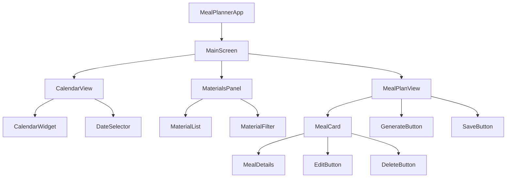
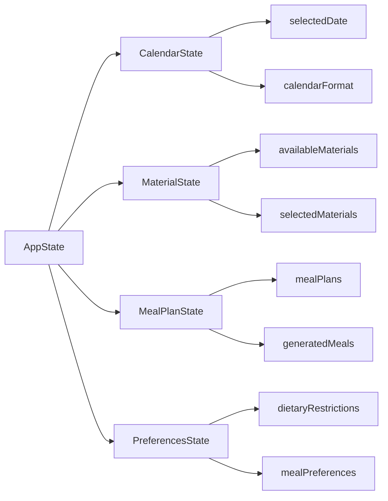
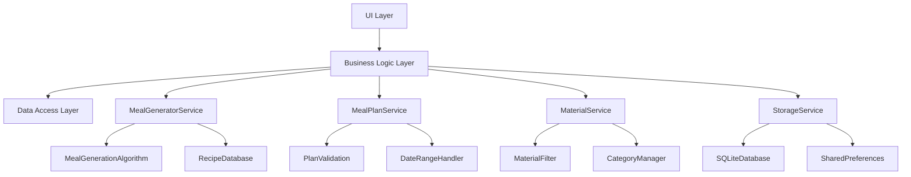
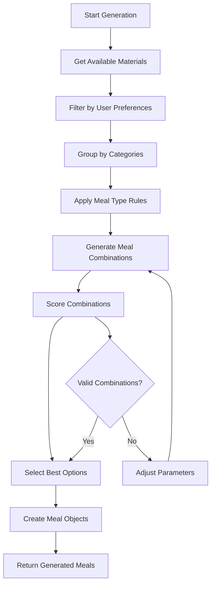
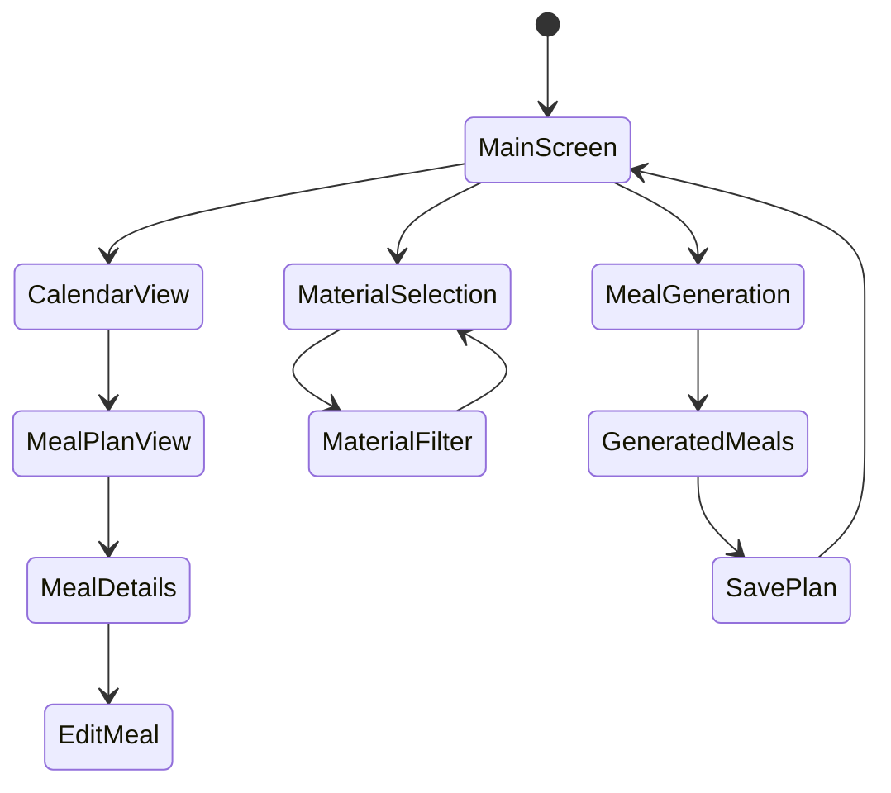

# Flutter Meal Planner App Design Document

## Overview

The Flutter Meal Planner is a simple, authentication-free mobile application that allows users to generate and manage meal plans in a calendar format. The app enables users to create meal plans for different time periods (week, month, or specific dates) based on available raw materials and dietary preferences.

### Key Features
- Calendar-based meal planning interface
- Raw material-based meal generation (chicken, meat, seafood, etc.)
- Flexible planning periods (weekly, monthly, custom date ranges)
- Material mixing and customization
- Local storage without authentication requirements
- Cross-platform support (iOS, Android, Web)

## Technology Stack & Dependencies

### Core Framework
- **Flutter SDK**: ^3.9.2
- **Dart**: Latest stable version
- **Material Design**: Flutter's built-in material design components

### Additional Dependencies
```yaml
dependencies:
  flutter:
    sdk: flutter
  table_calendar: ^3.0.9          # Calendar widget
  sqflite: ^2.3.0                # Local database
  provider: ^6.0.5               # State management
  uuid: ^4.0.0                   # Unique ID generation
  shared_preferences: ^2.2.0     # Simple key-value storage
  intl: ^0.18.1                  # Date formatting

dev_dependencies:
  flutter_test:
    sdk: flutter
  flutter_lints: ^5.0.0
  mockito: ^5.4.2               # Testing framework
```

## Component Architecture

### Component Hierarchy



### Component Definitions

#### 1. MealPlannerApp (Root Widget)
```dart
class MealPlannerApp extends StatelessWidget {
  // Root application widget with MaterialApp configuration
  // Defines app theme, routes, and global settings
}
```

#### 2. MainScreen (Primary Container)
```dart
class MainScreen extends StatefulWidget {
  // Main application screen container
  // Manages overall app state and navigation between sections
  // Props: selectedDate, currentView, materialPreferences
}
```

#### 3. CalendarView (Calendar Interface)
```dart
class CalendarView extends StatefulWidget {
  // Calendar widget for date selection and meal plan visualization
  // Props: selectedDate, mealPlans, onDateSelected
  // State: calendarFormat, focusedDay, selectedDay
}
```

#### 4. MaterialsPanel (Ingredient Management)
```dart
class MaterialsPanel extends StatefulWidget {
  // Panel for selecting and filtering available materials
  // Props: availableMaterials, selectedMaterials, onMaterialToggle
  // State: filterCategory, searchQuery
}
```

#### 5. MealPlanView (Meal Display & Generation)
```dart
class MealPlanView extends StatefulWidget {
  // Displays generated meals and provides generation controls
  // Props: selectedDate, mealPlan, materials, onGenerate, onSave
  // State: isGenerating, generatedMeals
}
```

#### 6. MealCard (Individual Meal Display)
```dart
class MealCard extends StatelessWidget {
  // Displays individual meal information
  // Props: mealName, description, materials, mealType, onEdit, onDelete
}
```

### State Management Architecture



## Data Models & Local Storage

### Core Data Models

#### Material Model
```dart
class Material {
  final String id;
  final String name;
  final MaterialCategory category;
  final List<String> nutritionalInfo;
  final bool isAvailable;
  
  Material({
    required this.id,
    required this.name,
    required this.category,
    this.nutritionalInfo = const [],
    this.isAvailable = true,
  });
}

enum MaterialCategory {
  meat,
  seafood,
  poultry,
  vegetables,
  grains,
  dairy,
  spices
}
```

#### Meal Model
```dart
class Meal {
  final String id;
  final String name;
  final String description;
  final List<Material> materials;
  final MealType mealType;
  final int preparationTime;
  final String instructions;
  
  Meal({
    required this.id,
    required this.name,
    required this.description,
    required this.materials,
    required this.mealType,
    this.preparationTime = 0,
    this.instructions = '',
  });
}

enum MealType { breakfast, lunch, dinner, snack }
```

#### MealPlan Model
```dart
class MealPlan {
  final String id;
  final DateTime date;
  final Map<MealType, Meal?> meals;
  final DateTime createdAt;
  final DateTime updatedAt;
  
  MealPlan({
    required this.id,
    required this.date,
    required this.meals,
    required this.createdAt,
    required this.updatedAt,
  });
}
```

### Database Schema (SQLite)

```sql
-- Materials table
CREATE TABLE materials (
  id TEXT PRIMARY KEY,
  name TEXT NOT NULL,
  category TEXT NOT NULL,
  nutritional_info TEXT, -- JSON string
  is_available INTEGER DEFAULT 1
);

-- Meals table
CREATE TABLE meals (
  id TEXT PRIMARY KEY,
  name TEXT NOT NULL,
  description TEXT,
  meal_type TEXT NOT NULL,
  preparation_time INTEGER DEFAULT 0,
  instructions TEXT,
  created_at DATETIME DEFAULT CURRENT_TIMESTAMP
);

-- Meal materials junction table
CREATE TABLE meal_materials (
  meal_id TEXT,
  material_id TEXT,
  quantity TEXT,
  FOREIGN KEY (meal_id) REFERENCES meals (id),
  FOREIGN KEY (material_id) REFERENCES materials (id),
  PRIMARY KEY (meal_id, material_id)
);

-- Meal plans table
CREATE TABLE meal_plans (
  id TEXT PRIMARY KEY,
  plan_date DATE NOT NULL,
  breakfast_meal_id TEXT,
  lunch_meal_id TEXT,
  dinner_meal_id TEXT,
  snack_meal_id TEXT,
  created_at DATETIME DEFAULT CURRENT_TIMESTAMP,
  updated_at DATETIME DEFAULT CURRENT_TIMESTAMP,
  FOREIGN KEY (breakfast_meal_id) REFERENCES meals (id),
  FOREIGN KEY (lunch_meal_id) REFERENCES meals (id),
  FOREIGN KEY (dinner_meal_id) REFERENCES meals (id),
  FOREIGN KEY (snack_meal_id) REFERENCES meals (id)
);
```

## Business Logic Layer

### Core Services Architecture



### Service Implementations

#### MealGeneratorService
```dart
class MealGeneratorService {
  // Core meal generation logic
  Future<List<Meal>> generateMeals({
    required List<Material> availableMaterials,
    required MealType mealType,
    int count = 3,
  });
  
  Future<MealPlan> generateWeeklyPlan({
    required DateTime startDate,
    required List<Material> materials,
  });
  
  Future<MealPlan> generateMonthlyPlan({
    required DateTime month,
    required List<Material> materials,
  });
  
  Future<Meal> generateCustomMeal({
    required List<Material> requiredMaterials,
    required MealType mealType,
    List<String>? dietaryRestrictions,
  });
}
```

#### MealPlanService
```dart
class MealPlanService {
  // Meal plan management operations
  Future<MealPlan?> getMealPlanForDate(DateTime date);
  Future<List<MealPlan>> getMealPlansForDateRange(DateTime start, DateTime end);
  Future<void> saveMealPlan(MealPlan mealPlan);
  Future<void> updateMealPlan(MealPlan mealPlan);
  Future<void> deleteMealPlan(String planId);
  Future<bool> hasMealPlanForDate(DateTime date);
}
```

#### MaterialService
```dart
class MaterialService {
  // Material management operations
  Future<List<Material>> getAllMaterials();
  Future<List<Material>> getMaterialsByCategory(MaterialCategory category);
  Future<List<Material>> getAvailableMaterials();
  Future<void> updateMaterialAvailability(String materialId, bool isAvailable);
  Future<List<Material>> searchMaterials(String query);
}
```

### Meal Generation Algorithm



## Routing & Navigation

### Navigation Structure
```dart
// Main navigation routes
class AppRoutes {
  static const String home = '/';
  static const String mealDetails = '/meal-details';
  static const String materials = '/materials';
  static const String settings = '/settings';
  static const String mealGeneration = '/generate';
}

// Route configuration
class AppRouter {
  static Route<dynamic> generateRoute(RouteSettings settings) {
    switch (settings.name) {
      case AppRoutes.home:
        return MaterialPageRoute(builder: (_) => MainScreen());
      case AppRoutes.mealDetails:
        return MaterialPageRoute(
          builder: (_) => MealDetailsScreen(meal: settings.arguments as Meal)
        );
      // ... other routes
    }
  }
}
```

### Navigation Flow


## Styling Strategy

### Theme Configuration
```dart
class AppTheme {
  static ThemeData lightTheme = ThemeData(
    primarySwatch: Colors.green,
    primaryColor: const Color(0xFF4CAF50),
    accentColor: const Color(0xFFFF9800),
    backgroundColor: const Color(0xFFF5F5F5),
    cardTheme: CardTheme(
      elevation: 2,
      shape: RoundedRectangleBorder(
        borderRadius: BorderRadius.circular(12),
      ),
    ),
    appBarTheme: const AppBarTheme(
      elevation: 0,
      backgroundColor: Color(0xFF4CAF50),
      foregroundColor: Colors.white,
    ),
  );
}
```

### Component Styling
```dart
class AppStyles {
  // Calendar styling
  static const calendarHeaderStyle = TextStyle(
    fontSize: 18,
    fontWeight: FontWeight.bold,
    color: Colors.black87,
  );
  
  // Meal card styling
  static const mealCardDecoration = BoxDecoration(
    color: Colors.white,
    borderRadius: BorderRadius.all(Radius.circular(12)),
    boxShadow: [
      BoxShadow(
        color: Colors.black12,
        blurRadius: 4,
        offset: Offset(0, 2),
      ),
    ],
  );
  
  // Material chip styling
  static const materialChipTheme = ChipThemeData(
    backgroundColor: Color(0xFFE8F5E8),
    selectedColor: Color(0xFF4CAF50),
    labelStyle: TextStyle(fontSize: 12),
  );
}
```

## Testing Strategy

### Unit Testing Structure
```
test/
├── models/
│   ├── material_test.dart
│   ├── meal_test.dart
│   └── meal_plan_test.dart
├── services/
│   ├── meal_generator_service_test.dart
│   ├── meal_plan_service_test.dart
│   └── material_service_test.dart
├── widgets/
│   ├── calendar_view_test.dart
│   ├── meal_card_test.dart
│   └── materials_panel_test.dart
└── integration/
    ├── meal_generation_flow_test.dart
    └── meal_plan_crud_test.dart
```

### Testing Examples
```dart
// Unit test example
class MealGeneratorServiceTest {
  group('MealGeneratorService', () {
    test('should generate meals with available materials', () async {
      // Arrange
      final service = MealGeneratorService();
      final materials = [
        Material(id: '1', name: 'Chicken', category: MaterialCategory.poultry),
        Material(id: '2', name: 'Rice', category: MaterialCategory.grains),
      ];
      
      // Act
      final meals = await service.generateMeals(
        availableMaterials: materials,
        mealType: MealType.lunch,
      );
      
      // Assert
      expect(meals, isNotEmpty);
      expect(meals.first.materials, containsAll(materials));
    });
  });
}

// Widget test example
class CalendarViewTest {
  testWidgets('should display calendar and handle date selection', (tester) async {
    // Arrange
    DateTime? selectedDate;
    final widget = CalendarView(
      selectedDate: DateTime.now(),
      onDateSelected: (date) => selectedDate = date,
    );
    
    // Act
    await tester.pumpWidget(MaterialApp(home: widget));
    await tester.tap(find.byType(TableCalendar));
    await tester.pump();
    
    // Assert
    expect(find.byType(TableCalendar), findsOneWidget);
    expect(selectedDate, isNotNull);
  });
}
```

### Integration Testing
```dart
class MealPlanningIntegrationTest {
  testWidgets('complete meal planning flow', (tester) async {
    // Test the full user journey from material selection to meal plan creation
    
    // 1. Launch app
    await tester.pumpWidget(MealPlannerApp());
    
    // 2. Select materials
    await tester.tap(find.text('Chicken'));
    await tester.tap(find.text('Rice'));
    
    // 3. Select date
    await tester.tap(find.byType(CalendarWidget));
    
    // 4. Generate meal plan
    await tester.tap(find.text('Generate Meals'));
    await tester.pumpAndSettle();
    
    // 5. Save meal plan
    await tester.tap(find.text('Save Plan'));
    
    // 6. Verify meal plan is saved
    expect(find.text('Meal plan saved successfully'), findsOneWidget);
  });
}
```