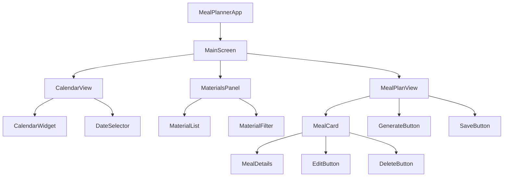
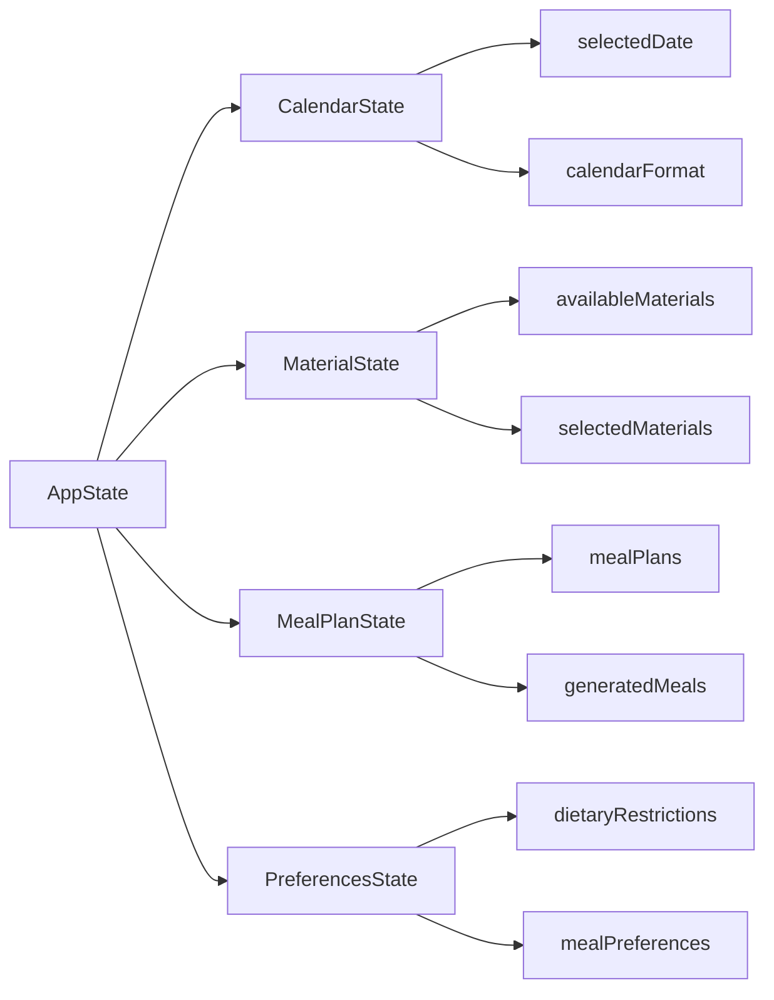
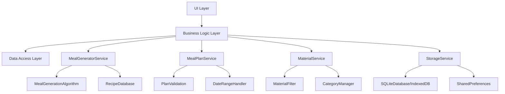
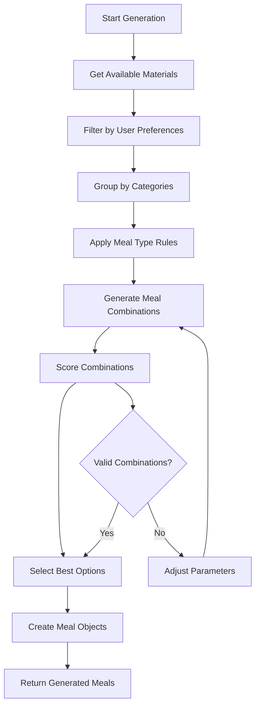
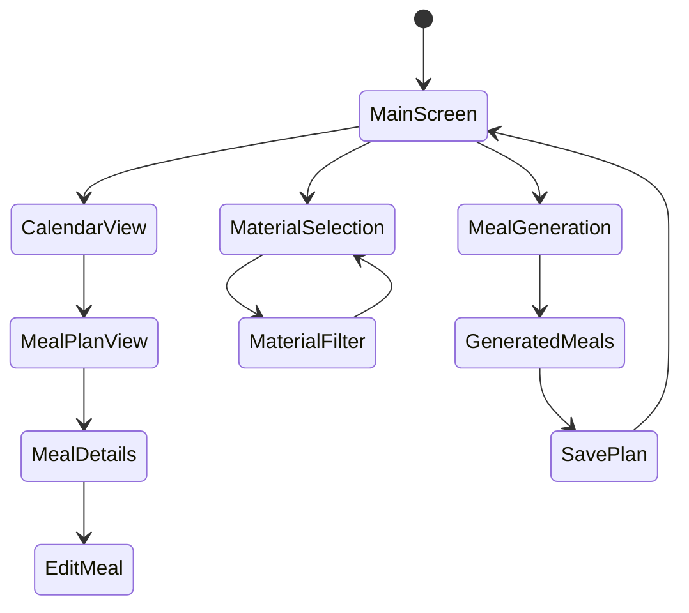
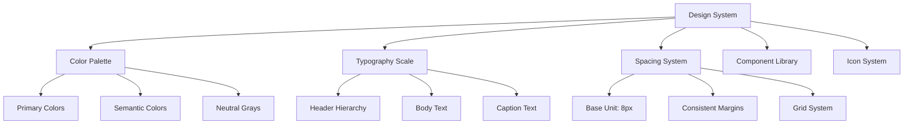
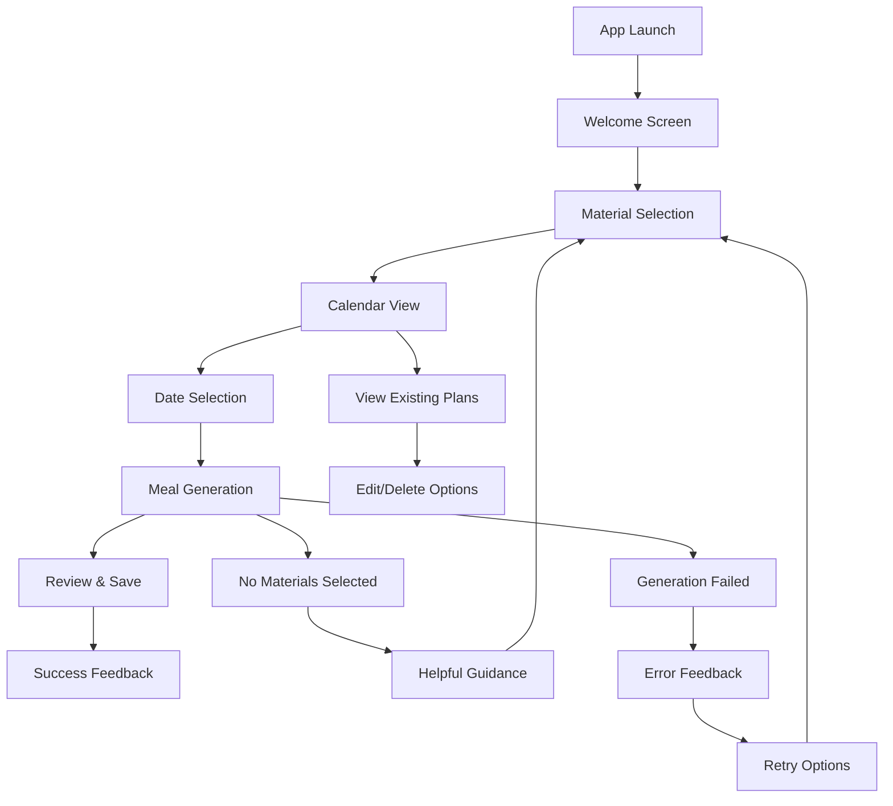

# Flutter Meal Planner App Design Document

## Overview

The Flutter Meal Planner is a simple, authentication-free mobile application that allows users to generate and manage meal plans in a calendar format. The app enables users to create meal plans for different time periods (week, month, or specific dates) based on available raw materials and dietary preferences.

### Key Features
- Calendar-based meal planning interface
- Raw material-based meal generation (chicken, meat, seafood, etc.)
- Flexible planning periods (weekly, monthly, custom date ranges)
- Material mixing and customization
- Local storage without authentication requirements
- Cross-platform support (Android, Web)

## Technology Stack & Dependencies

### Core Framework
- **Flutter SDK**: ^3.9.2
- **Dart**: Latest stable version
- **Material Design**: Flutter's built-in material design components

### Additional Dependencies
```yaml
dependencies:
  flutter:
    sdk: flutter
  table_calendar: ^3.0.9          # Calendar widget
  sqflite: ^2.3.0                # Local database (Android)
  sqflite_common_ffi_web: ^0.3.0 # Web database support
  provider: ^6.0.5               # State management
  uuid: ^4.0.0                   # Unique ID generation
  shared_preferences: ^2.2.0     # Simple key-value storage
  intl: ^0.18.1                  # Date formatting
  url_strategy: ^0.2.0           # Web URL configuration

dev_dependencies:
  flutter_test:
    sdk: flutter
  flutter_lints: ^5.0.0
  mockito: ^5.4.2               # Testing framework
```

## Component Architecture

### Component Hierarchy



### Component Definitions

#### 1. MealPlannerApp (Root Widget)
```dart
class MealPlannerApp extends StatelessWidget {
  // Root application widget with MaterialApp configuration
  // Defines app theme, routes, and global settings
}
```

#### 2. MainScreen (Primary Container)
```dart
class MainScreen extends StatefulWidget {
  // Main application screen container
  // Manages overall app state and navigation between sections
  // Props: selectedDate, currentView, materialPreferences
}
```

#### 3. CalendarView (Calendar Interface)
```dart
class CalendarView extends StatefulWidget {
  // Calendar widget for date selection and meal plan visualization
  // Props: selectedDate, mealPlans, onDateSelected
  // State: calendarFormat, focusedDay, selectedDay
}
```

#### 4. MaterialsPanel (Ingredient Management)
```dart
class MaterialsPanel extends StatefulWidget {
  // Panel for selecting and filtering available materials
  // Props: availableMaterials, selectedMaterials, onMaterialToggle
  // State: filterCategory, searchQuery
}
```

#### 5. MealPlanView (Meal Display & Generation)
```dart
class MealPlanView extends StatefulWidget {
  // Displays generated meals and provides generation controls
  // Props: selectedDate, mealPlan, materials, onGenerate, onSave
  // State: isGenerating, generatedMeals
}
```

#### 6. MealCard (Individual Meal Display)
```dart
class MealCard extends StatelessWidget {
  // Displays individual meal information
  // Props: mealName, description, materials, mealType, onEdit, onDelete
}
```

### State Management Architecture



## Data Models & Local Storage

### Core Data Models

#### Material Model
```dart
class Material {
  final String id;
  final String name;
  final MaterialCategory category;
  final List<String> nutritionalInfo;
  final bool isAvailable;
  
  Material({
    required this.id,
    required this.name,
    required this.category,
    this.nutritionalInfo = const [],
    this.isAvailable = true,
  });
}

enum MaterialCategory {
  meat,
  seafood,
  poultry,
  vegetables,
  grains,
  dairy,
  spices
}
```

#### Meal Model
```dart
class Meal {
  final String id;
  final String name;
  final String description;
  final List<Material> materials;
  final MealType mealType;
  final int preparationTime;
  final String instructions;
  
  Meal({
    required this.id,
    required this.name,
    required this.description,
    required this.materials,
    required this.mealType,
    this.preparationTime = 0,
    this.instructions = '',
  });
}

enum MealType { breakfast, lunch, dinner, snack }
```

#### MealPlan Model
```dart
class MealPlan {
  final String id;
  final DateTime date;
  final Map<MealType, Meal?> meals;
  final DateTime createdAt;
  final DateTime updatedAt;
  
  MealPlan({
    required this.id,
    required this.date,
    required this.meals,
    required this.createdAt,
    required this.updatedAt,
  });
}
```

### Database Schema (SQLite/IndexedDB)

**Platform-Specific Storage:**
- **Android**: SQLite database via `sqflite`
- **Web**: IndexedDB via `sqflite_common_ffi_web`

```sql
-- Materials table
CREATE TABLE materials (
  id TEXT PRIMARY KEY,
  name TEXT NOT NULL,
  category TEXT NOT NULL,
  nutritional_info TEXT, -- JSON string
  is_available INTEGER DEFAULT 1
);

-- Meals table
CREATE TABLE meals (
  id TEXT PRIMARY KEY,
  name TEXT NOT NULL,
  description TEXT,
  meal_type TEXT NOT NULL,
  preparation_time INTEGER DEFAULT 0,
  instructions TEXT,
  created_at DATETIME DEFAULT CURRENT_TIMESTAMP
);

-- Meal materials junction table
CREATE TABLE meal_materials (
  meal_id TEXT,
  material_id TEXT,
  quantity TEXT,
  FOREIGN KEY (meal_id) REFERENCES meals (id),
  FOREIGN KEY (material_id) REFERENCES materials (id),
  PRIMARY KEY (meal_id, material_id)
);

-- Meal plans table
CREATE TABLE meal_plans (
  id TEXT PRIMARY KEY,
  plan_date DATE NOT NULL,
  breakfast_meal_id TEXT,
  lunch_meal_id TEXT,
  dinner_meal_id TEXT,
  snack_meal_id TEXT,
  created_at DATETIME DEFAULT CURRENT_TIMESTAMP,
  updated_at DATETIME DEFAULT CURRENT_TIMESTAMP,
  FOREIGN KEY (breakfast_meal_id) REFERENCES meals (id),
  FOREIGN KEY (lunch_meal_id) REFERENCES meals (id),
  FOREIGN KEY (dinner_meal_id) REFERENCES meals (id),
  FOREIGN KEY (snack_meal_id) REFERENCES meals (id)
);
```

## Business Logic Layer

### Core Services Architecture



### Service Implementations

#### MealGeneratorService
```dart
class MealGeneratorService {
  // Core meal generation logic
  Future<List<Meal>> generateMeals({
    required List<Material> availableMaterials,
    required MealType mealType,
    int count = 3,
  });
  
  Future<MealPlan> generateWeeklyPlan({
    required DateTime startDate,
    required List<Material> materials,
  });
  
  Future<MealPlan> generateMonthlyPlan({
    required DateTime month,
    required List<Material> materials,
  });
  
  Future<Meal> generateCustomMeal({
    required List<Material> requiredMaterials,
    required MealType mealType,
    List<String>? dietaryRestrictions,
  });
}
```

#### MealPlanService
```dart
class MealPlanService {
  // Meal plan management operations
  Future<MealPlan?> getMealPlanForDate(DateTime date);
  Future<List<MealPlan>> getMealPlansForDateRange(DateTime start, DateTime end);
  Future<void> saveMealPlan(MealPlan mealPlan);
  Future<void> updateMealPlan(MealPlan mealPlan);
  Future<void> deleteMealPlan(String planId);
  Future<bool> hasMealPlanForDate(DateTime date);
}
```

#### MaterialService
```dart
class MaterialService {
  // Material management operations
  Future<List<Material>> getAllMaterials();
  Future<List<Material>> getMaterialsByCategory(MaterialCategory category);
  Future<List<Material>> getAvailableMaterials();
  Future<void> updateMaterialAvailability(String materialId, bool isAvailable);
  Future<List<Material>> searchMaterials(String query);
}
```

#### StorageService
```dart
class StorageService {
  // Platform-aware database operations
  Future<Database> get database;
  Future<void> initializeDatabase();
  
  // Platform-specific implementations
  // Android: SQLite via sqflite
  // Web: IndexedDB via sqflite_common_ffi_web
  
  Future<void> createTables();
  Future<List<Map<String, dynamic>>> query(String table, {String? where});
  Future<int> insert(String table, Map<String, dynamic> values);
  Future<int> update(String table, Map<String, dynamic> values, String where);
  Future<int> delete(String table, String where);
}
```

### Platform-Specific Configurations

#### Android Configuration
```dart
// android/app/build.gradle.kts
android {
    compileSdk = 34
    
    defaultConfig {
        minSdk = 21
        targetSdk = 34
    }
    
    // Enable ProGuard for release builds
    buildTypes {
        release {
            isMinifyEnabled = true
            proguardFiles(getDefaultProguardFile("proguard-android.txt"), "proguard-rules.pro")
        }
    }
}
```

#### Web Configuration
```dart
// web/index.html optimizations
<head>
  <meta charset="UTF-8">
  <meta content="IE=Edge" http-equiv="X-UA-Compatible">
  <meta name="description" content="Meal Planner - Generate personalized meal plans">
  <meta name="apple-mobile-web-app-capable" content="yes">
  <meta name="apple-mobile-web-app-status-bar-style" content="black">
  <meta name="apple-mobile-web-app-title" content="Meal Planner">
  <link rel="apple-touch-icon" href="icons/Icon-192.png">
  <link rel="icon" type="image/png" href="favicon.png"/>
  <meta name="viewport" content="width=device-width, initial-scale=1.0, maximum-scale=1.0, user-scalable=no">
</head>

// main.dart web initialization
import 'package:flutter/foundation.dart';
import 'package:url_strategy/url_strategy.dart';

void main() {
  if (kIsWeb) {
    setPathUrlStrategy(); // Remove # from URLs
  }
  runApp(const MealPlannerApp());
}
```

#### Database Platform Detection
```dart
class DatabaseHelper {
  static Database? _database;
  
  static Future<Database> get database async {
    if (_database != null) return _database!;
    
    if (kIsWeb) {
      // Web: Use IndexedDB through sqflite_common_ffi_web
      _database = await _initWebDatabase();
    } else {
      // Android: Use SQLite through sqflite
      _database = await _initMobileDatabase();
    }
    
    return _database!;
  }
  
  static Future<Database> _initWebDatabase() async {
    // Web-specific database initialization
    return await openDatabase(
      'meal_planner.db',
      version: 1,
      onCreate: _createTables,
    );
  }
  
  static Future<Database> _initMobileDatabase() async {
    // Android-specific database initialization
    final dbPath = await getDatabasesPath();
    final path = join(dbPath, 'meal_planner.db');
    
    return await openDatabase(
      path,
      version: 1,
      onCreate: _createTables,
    );
  }
}
```

### Meal Generation Algorithm



## Routing & Navigation

### Navigation Structure
```dart
// Main navigation routes
class AppRoutes {
  static const String home = '/';
  static const String mealDetails = '/meal-details';
  static const String materials = '/materials';
  static const String settings = '/settings';
  static const String mealGeneration = '/generate';
}

// Route configuration
class AppRouter {
  static Route<dynamic> generateRoute(RouteSettings settings) {
    switch (settings.name) {
      case AppRoutes.home:
        return MaterialPageRoute(builder: (_) => MainScreen());
      case AppRoutes.mealDetails:
        return MaterialPageRoute(
          builder: (_) => MealDetailsScreen(meal: settings.arguments as Meal)
        );
      // ... other routes
    }
  }
}
```

### Navigation Flow


## Styling Strategy

### Modern Minimalist Design Principles

#### Core Design Philosophy
- **Less is More**: Clean, uncluttered interfaces with purposeful elements
- **Functional Beauty**: Every design element serves a specific purpose
- **Consistent Visual Language**: Unified spacing, typography, and color usage
- **Accessibility First**: Inclusive design for all users
- **Platform Adaptive**: Responsive design that feels native on each platform

#### Visual Design System



#### Color Palette
```dart
class AppColors {
  // Primary Brand Colors
  static const Color primary = Color(0xFF2E7D32);      // Deep Green
  static const Color primaryLight = Color(0xFF60AD5E);  // Light Green
  static const Color primaryDark = Color(0xFF005005);   // Dark Green
  
  // Secondary Colors
  static const Color secondary = Color(0xFFFF6F00);     // Orange Accent
  static const Color secondaryLight = Color(0xFFFF9F40); // Light Orange
  static const Color secondaryDark = Color(0xFFC43E00);  // Dark Orange
  
  // Semantic Colors
  static const Color success = Color(0xFF4CAF50);
  static const Color warning = Color(0xFFFFC107);
  static const Color error = Color(0xFFF44336);
  static const Color info = Color(0xFF2196F3);
  
  // Neutral Colors
  static const Color background = Color(0xFFFAFAFA);    // Off-white
  static const Color surface = Color(0xFFFFFFFF);       // Pure white
  static const Color surfaceVariant = Color(0xFFF5F5F5); // Light gray
  
  // Text Colors
  static const Color textPrimary = Color(0xFF1C1C1E);   // Near black
  static const Color textSecondary = Color(0xFF6B6B6B); // Medium gray
  static const Color textTertiary = Color(0xFF9E9E9E);  // Light gray
  static const Color textDisabled = Color(0xFFBDBDBD);  // Very light gray
  
  // Interactive States
  static const Color hover = Color(0x0F000000);         // 6% black overlay
  static const Color pressed = Color(0x1F000000);       // 12% black overlay
  static const Color focused = Color(0x1F2E7D32);       // 12% primary overlay
  static const Color selected = Color(0x1F2E7D32);      // 12% primary overlay
}

### Typography System
```dart
class AppTypography {
  // Font Family
  static const String fontFamily = 'Inter'; // Clean, modern font
  
  // Display Styles (Large headings)
  static const TextStyle displayLarge = TextStyle(
    fontFamily: fontFamily,
    fontSize: 32,
    fontWeight: FontWeight.w300,
    letterSpacing: -0.5,
    height: 1.2,
    color: AppColors.textPrimary,
  );
  
  static const TextStyle displayMedium = TextStyle(
    fontFamily: fontFamily,
    fontSize: 28,
    fontWeight: FontWeight.w400,
    letterSpacing: -0.25,
    height: 1.3,
    color: AppColors.textPrimary,
  );
  
  // Headline Styles
  static const TextStyle headlineLarge = TextStyle(
    fontFamily: fontFamily,
    fontSize: 24,
    fontWeight: FontWeight.w500,
    letterSpacing: 0,
    height: 1.3,
    color: AppColors.textPrimary,
  );
  
  static const TextStyle headlineMedium = TextStyle(
    fontFamily: fontFamily,
    fontSize: 20,
    fontWeight: FontWeight.w500,
    letterSpacing: 0,
    height: 1.4,
    color: AppColors.textPrimary,
  );
  
  static const TextStyle headlineSmall = TextStyle(
    fontFamily: fontFamily,
    fontSize: 18,
    fontWeight: FontWeight.w500,
    letterSpacing: 0,
    height: 1.4,
    color: AppColors.textPrimary,
  );
  
  // Body Styles
  static const TextStyle bodyLarge = TextStyle(
    fontFamily: fontFamily,
    fontSize: 16,
    fontWeight: FontWeight.w400,
    letterSpacing: 0.15,
    height: 1.5,
    color: AppColors.textPrimary,
  );
  
  static const TextStyle bodyMedium = TextStyle(
    fontFamily: fontFamily,
    fontSize: 14,
    fontWeight: FontWeight.w400,
    letterSpacing: 0.25,
    height: 1.5,
    color: AppColors.textSecondary,
  );
  
  static const TextStyle bodySmall = TextStyle(
    fontFamily: fontFamily,
    fontSize: 12,
    fontWeight: FontWeight.w400,
    letterSpacing: 0.4,
    height: 1.4,
    color: AppColors.textTertiary,
  );
  
  // Label Styles
  static const TextStyle labelLarge = TextStyle(
    fontFamily: fontFamily,
    fontSize: 14,
    fontWeight: FontWeight.w500,
    letterSpacing: 0.25,
    height: 1.4,
    color: AppColors.textPrimary,
  );
  
  static const TextStyle labelMedium = TextStyle(
    fontFamily: fontFamily,
    fontSize: 12,
    fontWeight: FontWeight.w500,
    letterSpacing: 0.5,
    height: 1.3,
    color: AppColors.textSecondary,
  );
}
```

### Spacing System
```dart
class AppSpacing {
  // Base unit: 8px
  static const double unit = 8.0;
  
  // Spacing scale
  static const double xs = unit * 0.5;  // 4px
  static const double sm = unit * 1;    // 8px
  static const double md = unit * 2;    // 16px
  static const double lg = unit * 3;    // 24px
  static const double xl = unit * 4;    // 32px
  static const double xxl = unit * 6;   // 48px
  static const double xxxl = unit * 8;  // 64px
  
  // Component specific spacing
  static const EdgeInsets cardPadding = EdgeInsets.all(md);
  static const EdgeInsets screenPadding = EdgeInsets.all(lg);
  static const EdgeInsets buttonPadding = EdgeInsets.symmetric(
    horizontal: lg, 
    vertical: md,
  );
  
  // List item spacing
  static const double listItemSpacing = md;
  static const double sectionSpacing = xl;
  
  // Grid spacing
  static const double gridSpacing = md;
  static const double gridCrossAxisSpacing = md;
  static const double gridMainAxisSpacing = md;
}
```

### Component Design System

#### Material Design 3 Components
```dart
class AppComponents {
  // Card Design
  static Widget modernCard({
    required Widget child,
    VoidCallback? onTap,
    bool isSelected = false,
  }) {
    return Container(
      decoration: BoxDecoration(
        color: AppColors.surface,
        borderRadius: BorderRadius.circular(16),
        border: isSelected 
            ? Border.all(color: AppColors.primary, width: 2)
            : null,
        boxShadow: [
          BoxShadow(
            color: AppColors.textPrimary.withOpacity(0.08),
            blurRadius: 8,
            offset: const Offset(0, 2),
          ),
        ],
      ),
      child: Material(
        color: Colors.transparent,
        borderRadius: BorderRadius.circular(16),
        child: InkWell(
          onTap: onTap,
          borderRadius: BorderRadius.circular(16),
          splashColor: AppColors.primary.withOpacity(0.1),
          highlightColor: AppColors.primary.withOpacity(0.05),
          child: Padding(
            padding: AppSpacing.cardPadding,
            child: child,
          ),
        ),
      ),
    );
  }
  
  // Primary Button
  static Widget primaryButton({
    required String text,
    required VoidCallback? onPressed,
    bool isLoading = false,
    IconData? icon,
  }) {
    return SizedBox(
      height: 48,
      child: ElevatedButton(
        onPressed: isLoading ? null : onPressed,
        style: ElevatedButton.styleFrom(
          backgroundColor: AppColors.primary,
          foregroundColor: Colors.white,
          elevation: 0,
          shadowColor: Colors.transparent,
          shape: RoundedRectangleBorder(
            borderRadius: BorderRadius.circular(12),
          ),
          padding: AppSpacing.buttonPadding,
        ),
        child: isLoading
            ? const SizedBox(
                width: 20,
                height: 20,
                child: CircularProgressIndicator(
                  strokeWidth: 2,
                  valueColor: AlwaysStoppedAnimation<Color>(Colors.white),
                ),
              )
            : Row(
                mainAxisSize: MainAxisSize.min,
                children: [
                  if (icon != null) ..[
                    Icon(icon, size: 20),
                    const SizedBox(width: AppSpacing.sm),
                  ],
                  Text(
                    text,
                    style: AppTypography.labelLarge.copyWith(
                      color: Colors.white,
                    ),
                  ),
                ],
              ),
      ),
    );
  }
  
  // Chip Component
  static Widget materialChip({
    required String label,
    required bool isSelected,
    required VoidCallback onTap,
    IconData? icon,
  }) {
    return InkWell(
      onTap: onTap,
      borderRadius: BorderRadius.circular(20),
      child: Container(
        padding: const EdgeInsets.symmetric(
          horizontal: 16,
          vertical: 8,
        ),
        decoration: BoxDecoration(
          color: isSelected 
              ? AppColors.primary.withOpacity(0.12)
              : AppColors.surfaceVariant,
          borderRadius: BorderRadius.circular(20),
          border: isSelected
              ? Border.all(color: AppColors.primary, width: 1)
              : null,
        ),
        child: Row(
          mainAxisSize: MainAxisSize.min,
          children: [
            if (icon != null) ..[
              Icon(
                icon,
                size: 16,
                color: isSelected 
                    ? AppColors.primary 
                    : AppColors.textSecondary,
              ),
              const SizedBox(width: 4),
            ],
            Text(
              label,
              style: AppTypography.labelMedium.copyWith(
                color: isSelected 
                    ? AppColors.primary 
                    : AppColors.textSecondary,
                fontWeight: isSelected 
                    ? FontWeight.w600 
                    : FontWeight.w500,
              ),
            ),
          ],
        ),
      ),
    );
  }
}
```
```dart
class AppTheme {
  ### Advanced Theme Configuration
```dart
class AppTheme {
  // Material 3 Color Scheme
  static ColorScheme get lightColorScheme => ColorScheme.fromSeed(
    seedColor: AppColors.primary,
    brightness: Brightness.light,
    surface: AppColors.surface,
    background: AppColors.background,
  );
  
  static ThemeData get lightTheme => ThemeData(
    useMaterial3: true,
    colorScheme: lightColorScheme,
    fontFamily: AppTypography.fontFamily,
    
    // App Bar Theme
    appBarTheme: AppBarTheme(
      elevation: 0,
      scrolledUnderElevation: 1,
      backgroundColor: AppColors.surface,
      foregroundColor: AppColors.textPrimary,
      titleTextStyle: AppTypography.headlineMedium,
      systemOverlayStyle: SystemUiOverlayStyle.dark,
      centerTitle: false,
      toolbarHeight: 64,
    ),
    
    // Card Theme
    cardTheme: CardTheme(
      elevation: 0,
      color: AppColors.surface,
      surfaceTintColor: Colors.transparent,
      shape: RoundedRectangleBorder(
        borderRadius: BorderRadius.circular(16),
      ),
      margin: const EdgeInsets.all(0),
    ),
    
    // Elevated Button Theme
    elevatedButtonTheme: ElevatedButtonThemeData(
      style: ElevatedButton.styleFrom(
        elevation: 0,
        backgroundColor: AppColors.primary,
        foregroundColor: Colors.white,
        disabledBackgroundColor: AppColors.textDisabled,
        shape: RoundedRectangleBorder(
          borderRadius: BorderRadius.circular(12),
        ),
        padding: AppSpacing.buttonPadding,
        textStyle: AppTypography.labelLarge,
      ),
    ),
    
    // Text Button Theme
    textButtonTheme: TextButtonThemeData(
      style: TextButton.styleFrom(
        foregroundColor: AppColors.primary,
        shape: RoundedRectangleBorder(
          borderRadius: BorderRadius.circular(8),
        ),
        padding: const EdgeInsets.symmetric(
          horizontal: AppSpacing.md,
          vertical: AppSpacing.sm,
        ),
        textStyle: AppTypography.labelLarge,
      ),
    ),
    
    // Input Decoration Theme
    inputDecorationTheme: InputDecorationTheme(
      filled: true,
      fillColor: AppColors.surfaceVariant,
      contentPadding: const EdgeInsets.symmetric(
        horizontal: AppSpacing.md,
        vertical: AppSpacing.md,
      ),
      border: OutlineInputBorder(
        borderRadius: BorderRadius.circular(12),
        borderSide: BorderSide.none,
      ),
      enabledBorder: OutlineInputBorder(
        borderRadius: BorderRadius.circular(12),
        borderSide: BorderSide.none,
      ),
      focusedBorder: OutlineInputBorder(
        borderRadius: BorderRadius.circular(12),
        borderSide: BorderSide(
          color: AppColors.primary,
          width: 2,
        ),
      ),
      errorBorder: OutlineInputBorder(
        borderRadius: BorderRadius.circular(12),
        borderSide: BorderSide(
          color: AppColors.error,
          width: 1,
        ),
      ),
      hintStyle: AppTypography.bodyMedium.copyWith(
        color: AppColors.textTertiary,
      ),
      labelStyle: AppTypography.bodyMedium.copyWith(
        color: AppColors.textSecondary,
      ),
    ),
    
    // Bottom Navigation Bar Theme
    bottomNavigationBarTheme: BottomNavigationBarThemeData(
      backgroundColor: AppColors.surface,
      selectedItemColor: AppColors.primary,
      unselectedItemColor: AppColors.textTertiary,
      type: BottomNavigationBarType.fixed,
      elevation: 8,
      selectedLabelStyle: AppTypography.labelMedium,
      unselectedLabelStyle: AppTypography.labelMedium,
    ),
    
    // Divider Theme
    dividerTheme: DividerThemeData(
      color: AppColors.textDisabled.withOpacity(0.3),
      thickness: 0.5,
      space: 0.5,
    ),
    
    // List Tile Theme
    listTileTheme: ListTileThemeData(
      contentPadding: const EdgeInsets.symmetric(
        horizontal: AppSpacing.lg,
        vertical: AppSpacing.sm,
      ),
      titleTextStyle: AppTypography.bodyLarge,
      subtitleTextStyle: AppTypography.bodyMedium,
      shape: RoundedRectangleBorder(
        borderRadius: BorderRadius.circular(8),
      ),
    ),
  );
  
  // Platform-specific responsive design utilities
  static bool get isWeb => kIsWeb;
  static bool get isMobile => !kIsWeb;
  
  static double getScreenWidth(BuildContext context) {
    return MediaQuery.of(context).size.width;
  }
  
  static bool isLargeScreen(BuildContext context) {
    return getScreenWidth(context) > 600; // Tablet/Desktop breakpoint
  }
  
  static bool isExtraLargeScreen(BuildContext context) {
    return getScreenWidth(context) > 1200; // Desktop breakpoint
  }
  
  // Responsive padding
  static EdgeInsets responsivePadding(BuildContext context) {
    if (isExtraLargeScreen(context)) {
      return const EdgeInsets.all(AppSpacing.xxxl);
    } else if (isLargeScreen(context)) {
      return const EdgeInsets.all(AppSpacing.xl);
    }
    return const EdgeInsets.all(AppSpacing.lg);
  }
  
  // Grid columns based on screen size
  static int getGridColumns(BuildContext context) {
    if (isExtraLargeScreen(context)) return 4;
    if (isLargeScreen(context)) return 3;
    return 2;
  }
}
```

### Modern UI/UX Implementation

#### Layout Architecture
```dart
class ResponsiveLayout extends StatelessWidget {
  final Widget mobileLayout;
  final Widget? tabletLayout;
  final Widget? desktopLayout;
  
  const ResponsiveLayout({
    super.key,
    required this.mobileLayout,
    this.tabletLayout,
    this.desktopLayout,
  });
  
  @override
  Widget build(BuildContext context) {
    if (AppTheme.isExtraLargeScreen(context)) {
      return desktopLayout ?? tabletLayout ?? mobileLayout;
    } else if (AppTheme.isLargeScreen(context)) {
      return tabletLayout ?? mobileLayout;
    }
    return mobileLayout;
  }
}
```

#### Navigation Design
```dart
class ModernNavigationBar extends StatelessWidget {
  final int currentIndex;
  final Function(int) onTap;
  
  const ModernNavigationBar({
    super.key,
    required this.currentIndex,
    required this.onTap,
  });
  
  @override
  Widget build(BuildContext context) {
    return Container(
      decoration: BoxDecoration(
        color: AppColors.surface,
        boxShadow: [
          BoxShadow(
            color: AppColors.textPrimary.withOpacity(0.1),
            blurRadius: 8,
            offset: const Offset(0, -2),
          ),
        ],
      ),
      child: SafeArea(
        child: Padding(
          padding: const EdgeInsets.symmetric(
            horizontal: AppSpacing.lg,
            vertical: AppSpacing.sm,
          ),
          child: Row(
            mainAxisAlignment: MainAxisAlignment.spaceAround,
            children: _navigationItems.asMap().entries.map((entry) {
              final index = entry.key;
              final item = entry.value;
              final isSelected = index == currentIndex;
              
              return _NavigationItem(
                icon: item.icon,
                label: item.label,
                isSelected: isSelected,
                onTap: () => onTap(index),
              );
            }).toList(),
          ),
        ),
      ),
    );
  }
  
  static const _navigationItems = [
    NavigationItemData(Icons.calendar_today_outlined, 'Calendar'),
    NavigationItemData(Icons.restaurant_outlined, 'Materials'),
    NavigationItemData(Icons.auto_awesome_outlined, 'Generate'),
    NavigationItemData(Icons.settings_outlined, 'Settings'),
  ];
}

class _NavigationItem extends StatelessWidget {
  final IconData icon;
  final String label;
  final bool isSelected;
  final VoidCallback onTap;
  
  const _NavigationItem({
    required this.icon,
    required this.label,
    required this.isSelected,
    required this.onTap,
  });
  
  @override
  Widget build(BuildContext context) {
    return GestureDetector(
      onTap: onTap,
      child: AnimatedContainer(
        duration: const Duration(milliseconds: 200),
        padding: const EdgeInsets.symmetric(
          horizontal: AppSpacing.md,
          vertical: AppSpacing.sm,
        ),
        decoration: BoxDecoration(
          color: isSelected 
              ? AppColors.primary.withOpacity(0.1)
              : Colors.transparent,
          borderRadius: BorderRadius.circular(12),
        ),
        child: Column(
          mainAxisSize: MainAxisSize.min,
          children: [
            Icon(
              icon,
              color: isSelected 
                  ? AppColors.primary 
                  : AppColors.textTertiary,
              size: 24,
            ),
            const SizedBox(height: 4),
            Text(
              label,
              style: AppTypography.labelMedium.copyWith(
                color: isSelected 
                    ? AppColors.primary 
                    : AppColors.textTertiary,
                fontWeight: isSelected 
                    ? FontWeight.w600 
                    : FontWeight.w500,
              ),
            ),
          ],
        ),
      ),
    );
  }
}
```

#### Modern Calendar Design
```dart
class ModernCalendarCard extends StatelessWidget {
  final DateTime selectedDate;
  final Function(DateTime) onDateSelected;
  final Map<DateTime, List<MealPlan>> mealPlans;
  
  const ModernCalendarCard({
    super.key,
    required this.selectedDate,
    required this.onDateSelected,
    required this.mealPlans,
  });
  
  @override
  Widget build(BuildContext context) {
    return AppComponents.modernCard(
      child: Column(
        crossAxisAlignment: CrossAxisAlignment.start,
        children: [
          // Calendar Header
          Row(
            mainAxisAlignment: MainAxisAlignment.spaceBetween,
            children: [
              Text(
                'Meal Calendar',
                style: AppTypography.headlineMedium,
              ),
              IconButton(
                onPressed: () => _showCalendarOptions(context),
                icon: const Icon(Icons.more_vert),
                style: IconButton.styleFrom(
                  foregroundColor: AppColors.textSecondary,
                ),
              ),
            ],
          ),
          const SizedBox(height: AppSpacing.md),
          
          // Calendar Widget
          TableCalendar(
            firstDay: DateTime.utc(2020, 1, 1),
            lastDay: DateTime.utc(2030, 12, 31),
            focusedDay: selectedDate,
            selectedDayPredicate: (day) => isSameDay(selectedDate, day),
            onDaySelected: (selectedDay, focusedDay) {
              onDateSelected(selectedDay);
            },
            
            // Custom styling
            calendarStyle: CalendarStyle(
              outsideDaysVisible: false,
              weekendTextStyle: AppTypography.bodyMedium.copyWith(
                color: AppColors.textSecondary,
              ),
              defaultTextStyle: AppTypography.bodyMedium,
              selectedDecoration: BoxDecoration(
                color: AppColors.primary,
                shape: BoxShape.circle,
              ),
              todayDecoration: BoxDecoration(
                color: AppColors.primary.withOpacity(0.3),
                shape: BoxShape.circle,
              ),
              markerDecoration: BoxDecoration(
                color: AppColors.secondary,
                shape: BoxShape.circle,
              ),
              markersMaxCount: 3,
              canMarkersOverflow: false,
            ),
            
            headerStyle: HeaderStyle(
              formatButtonVisible: false,
              titleCentered: true,
              titleTextStyle: AppTypography.headlineSmall,
              leftChevronIcon: Icon(
                Icons.chevron_left,
                color: AppColors.textSecondary,
              ),
              rightChevronIcon: Icon(
                Icons.chevron_right,
                color: AppColors.textSecondary,
              ),
            ),
            
            daysOfWeekStyle: DaysOfWeekStyle(
              weekdayStyle: AppTypography.labelMedium.copyWith(
                color: AppColors.textSecondary,
              ),
              weekendStyle: AppTypography.labelMedium.copyWith(
                color: AppColors.textSecondary,
              ),
            ),
            
            // Meal plan markers
            eventLoader: (day) {
              return mealPlans[day] ?? [];
            },
          ),
        ],
      ),
    );
  }
}
```

#### Material Selection UI
```dart
class MaterialSelectionGrid extends StatelessWidget {
  final List<Material> materials;
  final Set<String> selectedMaterials;
  final Function(String) onMaterialToggle;
  
  const MaterialSelectionGrid({
    super.key,
    required this.materials,
    required this.selectedMaterials,
    required this.onMaterialToggle,
  });
  
  @override
  Widget build(BuildContext context) {
    final columns = AppTheme.getGridColumns(context);
    
    return GridView.builder(
      shrinkWrap: true,
      physics: const NeverScrollableScrollPhysics(),
      gridDelegate: SliverGridDelegateWithFixedCrossAxisCount(
        crossAxisCount: columns,
        crossAxisSpacing: AppSpacing.gridCrossAxisSpacing,
        mainAxisSpacing: AppSpacing.gridMainAxisSpacing,
        childAspectRatio: 1.2,
      ),
      itemCount: materials.length,
      itemBuilder: (context, index) {
        final material = materials[index];
        final isSelected = selectedMaterials.contains(material.id);
        
        return _MaterialCard(
          material: material,
          isSelected: isSelected,
          onTap: () => onMaterialToggle(material.id),
        );
      },
    );
  }
}

class _MaterialCard extends StatelessWidget {
  final Material material;
  final bool isSelected;
  final VoidCallback onTap;
  
  const _MaterialCard({
    required this.material,
    required this.isSelected,
    required this.onTap,
  });
  
  @override
  Widget build(BuildContext context) {
    return AppComponents.modernCard(
      onTap: onTap,
      isSelected: isSelected,
      child: Column(
        mainAxisAlignment: MainAxisAlignment.center,
        children: [
          // Material Icon
          Container(
            width: 48,
            height: 48,
            decoration: BoxDecoration(
              color: isSelected 
                  ? AppColors.primary.withOpacity(0.15)
                  : AppColors.surfaceVariant,
              borderRadius: BorderRadius.circular(12),
            ),
            child: Icon(
              _getMaterialIcon(material.category),
              color: isSelected 
                  ? AppColors.primary 
                  : AppColors.textSecondary,
              size: 24,
            ),
          ),
          
          const SizedBox(height: AppSpacing.sm),
          
          // Material Name
          Text(
            material.name,
            style: AppTypography.labelMedium.copyWith(
              color: isSelected 
                  ? AppColors.primary 
                  : AppColors.textPrimary,
              fontWeight: isSelected 
                  ? FontWeight.w600 
                  : FontWeight.w500,
            ),
            textAlign: TextAlign.center,
            maxLines: 2,
            overflow: TextOverflow.ellipsis,
          ),
        ],
      ),
    );
  }
  
  IconData _getMaterialIcon(MaterialCategory category) {
    switch (category) {
      case MaterialCategory.meat:
        return Icons.lunch_dining;
      case MaterialCategory.seafood:
        return Icons.set_meal;
      case MaterialCategory.poultry:
        return Icons.egg_alt;
      case MaterialCategory.vegetables:
        return Icons.eco;
      case MaterialCategory.grains:
        return Icons.grain;
      case MaterialCategory.dairy:
        return Icons.local_drink;
      case MaterialCategory.spices:
        return Icons.scatter_plot;
    }
  }
}
```
#### Accessibility & Usability Features
```dart
class AccessibilityHelper {
  // Semantic labels for screen readers
  static String getMaterialSemanticLabel(Material material, bool isSelected) {
    return '${material.name}, ${material.category.name}, ${isSelected ? 'selected' : 'not selected'}';
  }
  
  static String getMealSemanticLabel(Meal meal) {
    return '${meal.mealType.name}, ${meal.name}, preparation time ${meal.preparationTime} minutes';
  }
  
  // Focus management
  static void announceToScreenReader(BuildContext context, String message) {
    ScaffoldMessenger.of(context).showSnackBar(
      SnackBar(
        content: Text(message),
        duration: const Duration(milliseconds: 100),
        backgroundColor: Colors.transparent,
        elevation: 0,
      ),
    );
  }
  
  // High contrast support
  static bool isHighContrastMode(BuildContext context) {
    return MediaQuery.of(context).highContrast;
  }
  
  // Large text support
  static double getScaledFontSize(BuildContext context, double baseSize) {
    final textScaleFactor = MediaQuery.of(context).textScaleFactor;
    return baseSize * textScaleFactor;
  }
}
```

#### Animation & Micro-interactions
```dart
class AppAnimations {
  // Standard durations
  static const Duration fast = Duration(milliseconds: 150);
  static const Duration medium = Duration(milliseconds: 300);
  static const Duration slow = Duration(milliseconds: 500);
  
  // Standard curves
  static const Curve easeInOut = Curves.easeInOut;
  static const Curve easeOut = Curves.easeOut;
  static const Curve bounceOut = Curves.bounceOut;
  
  // Fade transition
  static Widget fadeTransition({
    required Widget child,
    required Animation<double> animation,
  }) {
    return FadeTransition(
      opacity: animation,
      child: child,
    );
  }
  
  // Scale transition
  static Widget scaleTransition({
    required Widget child,
    required Animation<double> animation,
  }) {
    return ScaleTransition(
      scale: Tween<double>(
        begin: 0.8,
        end: 1.0,
      ).animate(CurvedAnimation(
        parent: animation,
        curve: easeOut,
      )),
      child: child,
    );
  }
  
  // Slide transition
  static Widget slideTransition({
    required Widget child,
    required Animation<double> animation,
    Offset begin = const Offset(0.0, 0.1),
  }) {
    return SlideTransition(
      position: Tween<Offset>(
        begin: begin,
        end: Offset.zero,
      ).animate(CurvedAnimation(
        parent: animation,
        curve: easeOut,
      )),
      child: child,
    );
  }
}
```

#### Loading States & Feedback
```dart
class LoadingStates {
  // Shimmer loading effect
  static Widget shimmerCard() {
    return Container(
      decoration: BoxDecoration(
        color: AppColors.surfaceVariant,
        borderRadius: BorderRadius.circular(16),
      ),
      child: Shimmer.fromColors(
        baseColor: AppColors.surfaceVariant,
        highlightColor: AppColors.surface,
        child: Column(
          crossAxisAlignment: CrossAxisAlignment.start,
          children: [
            Container(
              height: 120,
              decoration: BoxDecoration(
                color: Colors.white,
                borderRadius: BorderRadius.circular(12),
              ),
            ),
            const SizedBox(height: AppSpacing.sm),
            Container(
              height: 16,
              width: double.infinity,
              color: Colors.white,
            ),
            const SizedBox(height: AppSpacing.xs),
            Container(
              height: 14,
              width: 120,
              color: Colors.white,
            ),
          ],
        ),
      ),
    );
  }
  
  // Empty state illustration
  static Widget emptyState({
    required String title,
    required String description,
    required IconData icon,
    Widget? action,
  }) {
    return Center(
      child: Padding(
        padding: const EdgeInsets.all(AppSpacing.xl),
        child: Column(
          mainAxisAlignment: MainAxisAlignment.center,
          children: [
            Container(
              width: 80,
              height: 80,
              decoration: BoxDecoration(
                color: AppColors.primary.withOpacity(0.1),
                borderRadius: BorderRadius.circular(40),
              ),
              child: Icon(
                icon,
                size: 40,
                color: AppColors.primary.withOpacity(0.7),
              ),
            ),
            const SizedBox(height: AppSpacing.lg),
            Text(
              title,
              style: AppTypography.headlineMedium.copyWith(
                color: AppColors.textPrimary,
              ),
              textAlign: TextAlign.center,
            ),
            const SizedBox(height: AppSpacing.sm),
            Text(
              description,
              style: AppTypography.bodyMedium.copyWith(
                color: AppColors.textSecondary,
              ),
              textAlign: TextAlign.center,
            ),
            if (action != null) ..[
              const SizedBox(height: AppSpacing.lg),
              action,
            ],
          ],
        ),
      ),
    );
  }
  
  // Success feedback
  static void showSuccessSnackBar(
    BuildContext context,
    String message,
  ) {
    ScaffoldMessenger.of(context).showSnackBar(
      SnackBar(
        content: Row(
          children: [
            Icon(
              Icons.check_circle,
              color: AppColors.success,
            ),
            const SizedBox(width: AppSpacing.sm),
            Expanded(
              child: Text(
                message,
                style: AppTypography.bodyMedium.copyWith(
                  color: Colors.white,
                ),
              ),
            ),
          ],
        ),
        backgroundColor: AppColors.textPrimary,
        behavior: SnackBarBehavior.floating,
        shape: RoundedRectangleBorder(
          borderRadius: BorderRadius.circular(8),
        ),
        margin: const EdgeInsets.all(AppSpacing.md),
      ),
    );
  }
}
```

### UX Best Practices Implementation

#### User Journey Optimization


#### Progressive Disclosure Pattern
```dart
class ProgressiveDisclosure {
  // Expandable sections for detailed information
  static Widget expandableSection({
    required String title,
    required Widget content,
    bool initiallyExpanded = false,
  }) {
    return Theme(
      data: ThemeData().copyWith(
        dividerColor: Colors.transparent,
      ),
      child: ExpansionTile(
        title: Text(
          title,
          style: AppTypography.headlineSmall,
        ),
        initiallyExpanded: initiallyExpanded,
        children: [
          Padding(
            padding: const EdgeInsets.all(AppSpacing.md),
            child: content,
          ),
        ],
      ),
    );
  }
  
  // Step-by-step wizard interface
  static Widget stepIndicator({
    required int currentStep,
    required int totalSteps,
    required List<String> stepLabels,
  }) {
    return Row(
      children: List.generate(
        totalSteps,
        (index) => Expanded(
          child: Row(
            children: [
              Expanded(
                child: Container(
                  height: 4,
                  decoration: BoxDecoration(
                    color: index < currentStep
                        ? AppColors.primary
                        : AppColors.surfaceVariant,
                    borderRadius: BorderRadius.circular(2),
                  ),
                ),
              ),
              if (index < totalSteps - 1)
                const SizedBox(width: 4),
            ],
          ),
        ),
      ),
    );
  }
}
```
```

## Testing Strategy

### Unit Testing Structure
```
test/
├── models/
│   ├── material_test.dart
│   ├── meal_test.dart
│   └── meal_plan_test.dart
├── services/
│   ├── meal_generator_service_test.dart
│   ├── meal_plan_service_test.dart
│   └── material_service_test.dart
├── widgets/
│   ├── calendar_view_test.dart
│   ├── meal_card_test.dart
│   └── materials_panel_test.dart
└── integration/
    ├── meal_generation_flow_test.dart
    └── meal_plan_crud_test.dart
```

### Testing Examples
```dart
// Unit test example
class MealGeneratorServiceTest {
  group('MealGeneratorService', () {
    test('should generate meals with available materials', () async {
      // Arrange
      final service = MealGeneratorService();
      final materials = [
        Material(id: '1', name: 'Chicken', category: MaterialCategory.poultry),
        Material(id: '2', name: 'Rice', category: MaterialCategory.grains),
      ];
      
      // Act
      final meals = await service.generateMeals(
        availableMaterials: materials,
        mealType: MealType.lunch,
      );
      
      // Assert
      expect(meals, isNotEmpty);
      expect(meals.first.materials, containsAll(materials));
    });
  });
}

// Widget test example
class CalendarViewTest {
  testWidgets('should display calendar and handle date selection', (tester) async {
    // Arrange
    DateTime? selectedDate;
    final widget = CalendarView(
      selectedDate: DateTime.now(),
      onDateSelected: (date) => selectedDate = date,
    );
    
    // Act
    await tester.pumpWidget(MaterialApp(home: widget));
    await tester.tap(find.byType(TableCalendar));
    await tester.pump();
    
    // Assert
    expect(find.byType(TableCalendar), findsOneWidget);
    expect(selectedDate, isNotNull);
  });
}
```

### Integration Testing
```dart
class MealPlanningIntegrationTest {
  testWidgets('complete meal planning flow', (tester) async {
    // Test the full user journey from material selection to meal plan creation
    
    // 1. Launch app
    await tester.pumpWidget(MealPlannerApp());
    
    // 2. Select materials
    await tester.tap(find.text('Chicken'));
    await tester.tap(find.text('Rice'));
    
    // 3. Select date
    await tester.tap(find.byType(CalendarWidget));
    
    // 4. Generate meal plan
    await tester.tap(find.text('Generate Meals'));
    await tester.pumpAndSettle();
    
    // 5. Save meal plan
    await tester.tap(find.text('Save Plan'));
    
    // 6. Verify meal plan is saved
    expect(find.text('Meal plan saved successfully'), findsOneWidget);
  });
}
```