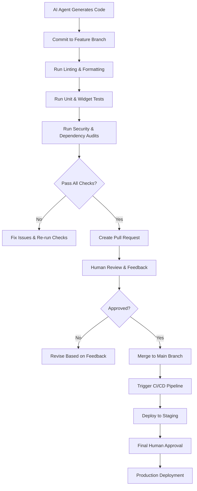

# AI Agent Coding Workflow Rules  
_Standardized rules and best practices for AI-assisted application development, including React and Flutter environments._

---

## 1. General Workflow Principles  
- AI agents act as **junior developers under human oversight**, not autonomous deployers.  
- All AI-generated code must follow **Git-based branching** and **code review workflows**.  
- Maintain strict **traceability**: every AI contribution must include reasoning, comments, and associated tests.  

---

## 2. Workflow Rules  

### Rule 1: Git-Based Contribution  
- All AI-generated code is committed on **feature branches**.  
- PRs must include:  
  - Code comments and auto-generated summary of reasoning.  
  - Linked tests and documentation updates.  
- Human review is mandatory before merging to `main`.  

### Rule 2: Testing First  
- AI must generate tests **alongside implementation**.  
- **React:** Use **Jest + React Testing Library**.  
- **Flutter:** Use **flutter_test** with both **unit tests** and **widget tests**.  
- All PRs must pass **100% test execution** before merge.  

### Rule 3: Linting & Formatting  
- **React:** Run `eslint` + `prettier`.  
- **Flutter:** Run `flutter analyze` + `dart format`.  
- PRs failing lint/format checks are rejected automatically.  

### Rule 4: Dependency & Security Hygiene  
- AI must run dependency audits before commit:  
  - **React:** `npm audit fix` or `yarn audit`.  
  - **Flutter:** `flutter pub outdated`.  
- Critical/breaking changes flagged for human approval.  
- No new dependency added without justification.  

### Rule 5: Human-AI Feedback Loop  
- AI must validate business logic, UX, and architectural intent with **checkpoints**:  
  1. Design alignment  
  2. Accessibility compliance  
  3. Security & performance checks  
- AI cannot deploy; final approval rests with human developers.  

---

## 3. React-Specific Best Practices  
- Enforce **functional components + hooks** unless otherwise specified.  
- Respect project’s chosen **state management strategy** (e.g., Redux, Recoil, Zustand).  
- Ensure components are **isolated and reusable**.  
- Accessibility rules: enforce `aria-*` attributes and semantic HTML.  

---

## 4. Flutter-Specific Best Practices  
- Optimize **widget tree depth** (avoid unnecessary nesting).  
- Use **const constructors** wherever possible.  
- Respect chosen **state management strategy** (e.g., Provider, Riverpod, Bloc).  
- Validate platform-channel safety for iOS/Android integrations.  

---

## 5. CI/CD Integration  
- All PRs must trigger:  
  - Automated tests (unit + integration).  
  - Linting/format checks.  
  - Security/dependency scans.  
- AI agents can propose fixes but cannot merge or deploy without human validation.  

---

## 6. Future-Proofing Rules  
- Design code with **extensibility** in mind (plugin-friendly, modular).  
- Require AI to suggest **alternative approaches** for critical features.  
- Enforce continuous monitoring of **framework evolution** (React 19+, Flutter 4+).  

---

## 7. Workflow Diagram  

---

## 8. Summary  
By following this workflow, AI agents become **accelerators of disciplined development**, ensuring speed without sacrificing quality, security, or long-term maintainability.  
